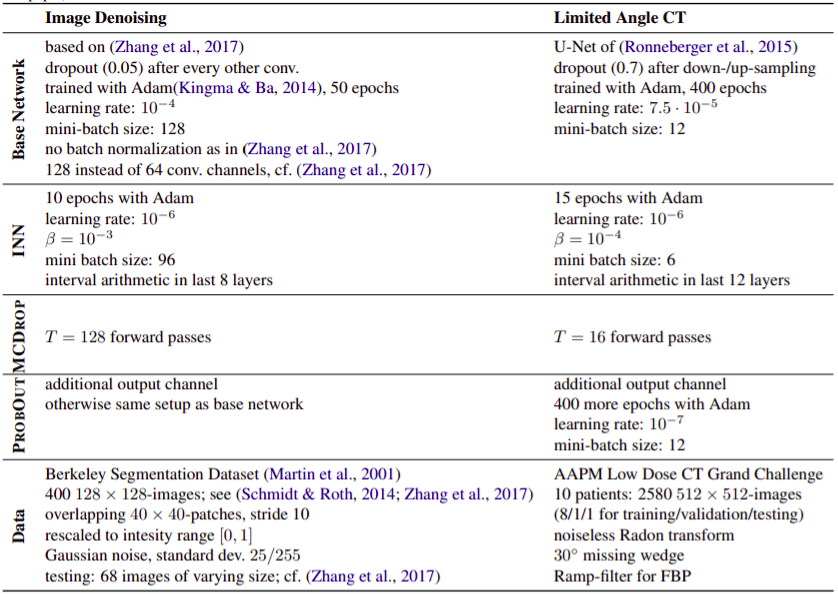

# Detecting Failure Modes in Image Reconstructions with Interval Neural Network Uncertainty
[**Paper**](https://link.springer.com/article/10.1007/s11548-021-02482-2#citeas) | [**ICML UDL 2020 Spotlight Talk**](https://slideslive.com/38930948/detecting-failure-modes-in-image-reconstructions-with-interval-neural-network-uncertainty?ref=speaker-37644-latest) | [**ACM CHIL 2020 Talk**](https://slideslive.com/38931985/detecting-failure-modes-in-image-reconstructions-with-interval-neural-network-uncertainty?ref=speaker-37644-latest) | [**BVM 2021 Best Paper Award**](https://twitter.com/FraunhoferHHI/status/1379765991622709250)

This repo hosts code for our project on Interval Neural Networks (INNs) and the detection of deep neural network failure modes in image reconstruction tasks.
## A short introduction
For a short tutorial on this work you can check out the talks we gave at 
| [ICML UDL 2020](https://slideslive.com/38930948/detecting-failure-modes-in-image-reconstructions-with-interval-neural-network-uncertainty?ref=speaker-37644-latest) | [ACM CHIL 2020](https://slideslive.com/38931985/detecting-failure-modes-in-image-reconstructions-with-interval-neural-network-uncertainty?ref=speaker-37644-latest) |
| --- | --- |
|  |  |
### Purpose
The quantitative detection of failure modes is important for making deep neural networks reliable and usable at scale. We consider three examples for common failure modes in image reconstruction and demonstrate the potential of uncertainty quantification as a fine-grained alarm system.
### Methods
We propose a deterministic, modular and lightweight approach called Interval Neural Network (INN) that produces fast and easy to interpret uncertainty scores for deep neural networks. Importantly, INNs can be constructed post hoc for already trained prediction networks. We compare it against state-of-the-art baseline methods (MCDROP, PROBOUT).
### Results
We demonstrate on controlled, synthetic inverse problems the capacity of INNs to capture uncertainty due to noise as well as directional error information. On a real-world inverse problem with human CT scans, we can show that INNs produce uncertainty scores which improve the detection of all considered failure modes compared to the baseline methods.
### Conclusion
Interval Neural Networks offer a promising tool to expose weaknesses of deep image reconstruction models and ultimately make them more reliable. The fact that they can be applied post hoc to equip already trained deep neural network models with uncertainty scores makes them particularly interesting for deployment.

An example of different uncertainty heatmaps for errors in the DNN image reconstructions.
## Data access
For the CT data individual access has to be granted by the data owner, more info can be found here https://www.aapm.org/GrandChallenge/LowDoseCT/. We would like to thank Dr. Cynthia McCollough, the Mayo Clinic, and the American Association of Physicists in Medicine as well as the grants EB017095 and EB017185 from the National Institute of Biomedical Imaging and Bioengineering for providing the AAPM data.
## Code
### Recreating experiments
`ct_experiments/keras_interval_networks/`: contains the generic code for interval neural network arithmetic with `keras`

`find-adv/find_adv_input.py`: allows you to find adversarial inputs for an image-to-image regression model

`make-ood/make_ood.py`: allows you to create inputs with atypical artifacts
### Hyperparameters used in our experiments

## Cite as

    @article{oala2021detecting,
      title={Detecting failure modes in image reconstructions with interval neural network uncertainty},
      author={Oala, Luis and Hei{\ss}, Cosmas and Macdonald, Jan and M{\"a}rz, Maximilian and Kutyniok, Gitta and Samek, Wojciech},
      journal={International Journal of Computer Assisted Radiology and Surgery},
      pages={1--9},
      year={2021},
      publisher={Springer}
    }
**For any questions feel free to open an issue or contact us**
