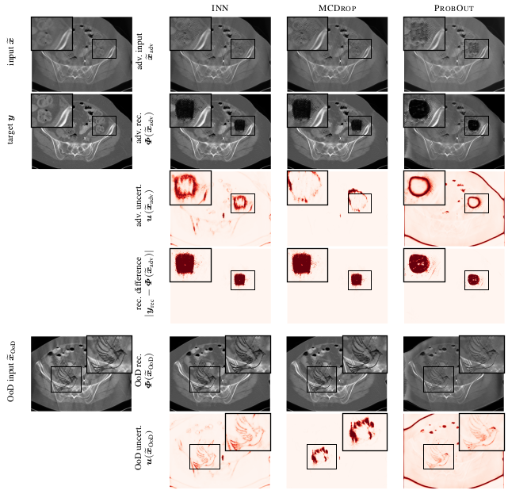

### Detecting Failure Modes in Image Reconstructions with Interval Neural Network Uncertainty
This repo hosts code for experiments around the detection of deep neural network failure modes in image reconstruction tasks.

