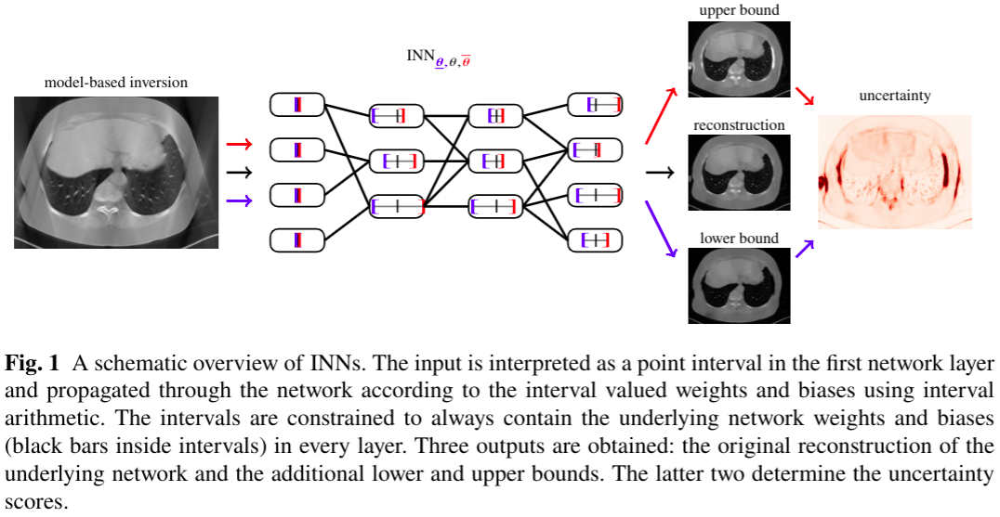
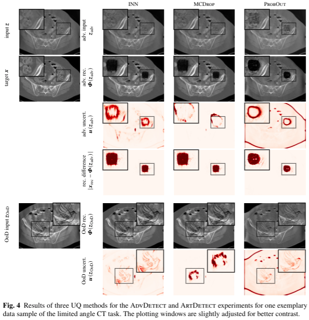

<!-- mathjax include -->
<!--  -->
<!-- defining some tex commands that can be used throughout the page-->
# Idea

# Detection of Failure Modes

<!--TODO port to the other three papers -> start with ICML-->

